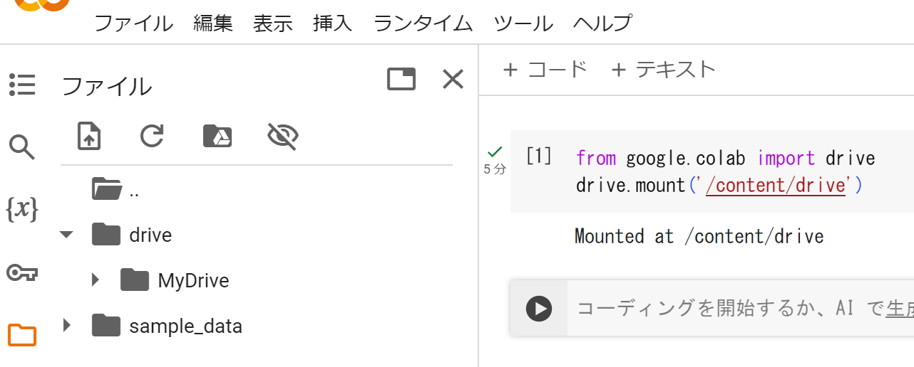

# 情報科学実習python版


### ファイルの内容
* [初歩的な説明、四則演算と参考サイトの紹介](p0.ipynb)
* [関数のプロット、線形回帰](p1.ipynb)
* [区分求積法](p2.ipynb)
* [正規分布関数の性質](p3.ipynb)
* [ヘモグロビンの飽和曲線の実験データを理論式に当てはめる](p4.ipynb)
* [ロジスティック写像　パラメータを変化させて実行する](p5.ipynb)
* [統計関数](p7.ipynb)
* [微分方程式の数値解法](p8.ipynb)
  
### 必要なライブラリ
* [matplotlib](https://matplotlib.org/stable/tutorials/index.html) グラフを描く
* (japanize_matplotlib 日本語でラベルを付けたいとき)
* numpy [数学関数](https://numpy.org/doc/stable/reference/routines.math.html)、
  [等間隔な配列をつくる](https://numpy.org/doc/stable/user/how-to-partition.html)
* [pandas](https://pandas.pydata.org/docs/getting_started/) データ解析用　表データ(csv,excel)の読み込みと書き出し　
* [scipy](https://docs.scipy.org/doc/scipy/tutorial/index.html#user-guide) 科学技術計算　統計、積分をはじめ多岐にわたる道具をそなえる
* [scikit-learn](https://scikit-learn.org/stable/getting_started.html) 機械学習全般 
* [ipywidgets](https://ipywidgets.readthedocs.io/en/stable/how-to/index.html) notebookをインターラクティヴにしてパラメータを動的に変化させることができる。

ライブラリがインストールされていないときは、notebook内で次の様に実行する
```
!pip install ライブラリ名 
```

### Google Colaboratory
gmailなどのアカウントを持っていればすぐに使える。
CodeからDownload ZIPでダウンロードして展開した後、google driveにフォルダごとアップロードする。
データファイルがnotebookと同じフォルダにあってもそのままでは読み込めず、ドライブをマウントするという操作が必要になる。
```
from google.colab import drive
drive.mount('/content/drive')
```
とすると、認証を求められ、許可するとマウントされる。
<!-- -->
接続するをクリック


自分のアカウントをクリック
<!--  -->


次へ


続行


<!--


-->

右側にフォルダが表示されるが、driveの下にMyDriveがある。

<!--  -->


GoogleDriveからフォルダを作らずにアップロードした場合はMyDrive直下にアップロードしたフォルダがある。notebookと同じフォルダ(joho-main)にあるp1.csvを読み込むときは
```
file = '/content/drive/MyDrive/joho-main/p1.csv'
pd.read_csv(file)
```
とすれば読み込める。


